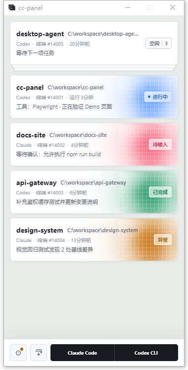

# cc-panel

[English](./README_EN.md)

一个面向 Windows 的 Claude Code / Codex CLI 多会话状态面板。它把分散在不同终端里的 AI 编程会话集中展示，让你快速判断哪个会话正在运行、等待输入、已经完成或出现异常，并可点击卡片直接切回对应终端窗口。



## 功能

- 同时跟踪 Claude Code 与 Codex CLI 会话
- 展示项目目录、终端进程、状态持续时间和最近操作
- 区分进行中、待输入、已完成、异常与空闲状态
- 在列表首位自动堆叠空闲会话，悬停时展开，离开 3 秒后重新收起
- 点击会话卡片聚焦对应的终端窗口
- 一键收起所有已关联的终端窗口
- 从选定目录直接启动 Claude Code 或 Codex CLI
- 保留最近使用的目录，便于快速重新打开会话
- 自动识别 Windows Terminal 等本机终端，也可指定其他 EXE
- 支持窗口置顶、状态提示音和开机自启动
- 自动安装并检查 Claude Code / Codex CLI hooks

## 会话状态

| 状态 | 界面表现 | 含义 |
| --- | --- | --- |
| 进行中 | 蓝色玻璃灯光、标签涟漪 | Agent 正在执行任务 |
| 待输入 | 红色玻璃灯光 | 等待权限确认或用户回复 |
| 已完成 | 绿色玻璃灯光 | 当前回合已经完成 |
| 异常 | 琥珀色玻璃灯光 | 工具执行失败或会话异常停止 |
| 空闲 | 无灯光、仅保留像素玻璃 | 会话已启动，当前可以继续输入 |

## 环境要求

- Windows 10 或 Windows 11
- Node.js 与 npm
- 已安装并可使用 Claude Code、Codex CLI 中的至少一个

## 本地运行

```powershell
npm install
npm start
```

应用启动后会自动安装所需 hooks。随后在终端中运行 `claude` 或 `codex`，对应会话便会出现在面板中。

只想查看界面和状态样例时，可以启动演示模式：

```powershell
npm run demo
```

演示模式不会启动本地事件服务、安装 hooks、读取真实会话或修改正式配置，可以与正式面板同时运行。

## 使用说明

- 点击会话卡片可切换到对应终端。
- 点击底部的 `Claude Code` 或 `Codex CLI` 按钮并选择工作目录，可新建会话。
- 将鼠标悬停在启动按钮上，可从最近使用的目录中快速启动。
- 点击底部的设置按钮，可调整窗口置顶、提示音、开机自启动和终端程序。
- 点击底部的收起按钮，或按 `Ctrl+Shift+Z`，可最小化所有已识别的终端窗口。

## 配置与 hooks

运行数据保存在用户主目录的 `~/.cc-panel/`：

- `config.json`：窗口位置与应用设置
- `runtime.json`：本地事件服务的运行信息

应用通过本机回环地址接收 hooks 事件，候选端口为 `24333` 至 `24337`。启动时会更新以下配置：

- Claude Code：`~/.claude/settings.json`
- Codex CLI：`$CODEX_HOME/hooks.json`，未设置 `CODEX_HOME` 时使用 `~/.codex/hooks.json`

首次修改前，应用会分别创建带 `.cc-panel-bak` 后缀的备份文件，并保留配置中已有的其他 hooks。面板每 5 秒检查一次 hooks 和正在运行的会话，缺失的 cc-panel hook 会被自动补回。

新安装的 hooks 只会由之后启动的 Claude Code / Codex CLI 会话读取。Codex CLI 若提示 hooks 尚未信任，请在 Codex 中运行 `/hooks`，审核并信任 cc-panel hook；hook 内容更新后可能需要重新信任。

## 工作原理

```text
Claude Code / Codex CLI
        │ hooks
        ▼
hook/cc-panel-hook.js
        │ HTTP POST（仅本机回环地址）
        ▼
cc-panel ──► 会话状态卡片 ──► 对应终端窗口
```

状态主要由 Agent hooks 提供。hook 会记录会话所属的终端窗口并将事件发送给面板；面板也会定期扫描本机进程，补充尚未产生 hook 事件的会话。点击卡片时，应用通过 Windows API 还原并聚焦对应窗口。

## 已知限制

- hooks 缺失或尚未被新会话加载时，进程扫描仍可创建卡片，但进行中、待输入等实时状态依赖 hook 事件。
- 在 VS Code 或其他未识别的终端中运行时，会话状态可以显示，但卡片可能标记为“无窗口”且无法聚焦。
- 多个 Agent 位于同一个 Windows Terminal 窗口的不同标签页时，它们共享同一个顶层窗口句柄，面板无法切换到指定标签页。建议使用面板底部按钮创建独立窗口。
- 提交 prompt 后立即切换窗口，可能使前台窗口识别不准确；下一次提交会重新刷新映射。

## 卸载 hooks

当前界面没有卸载入口。可删除 `~/.claude/settings.json` 和 `~/.codex/hooks.json` 中命令包含 `cc-panel-hook.js` 或 `cc-panel-hook.cmd` 的 cc-panel 条目，或使用对应的 `.cc-panel-bak` 文件恢复。退出或删除应用不会自动清理这些 hooks。

## 开发

```powershell
# 运行测试
npm test

# 启动开发版本
npm start

# 启动演示数据
npm run demo
```

项目使用 Electron 构建，主进程代码位于 `src/main/`，界面代码位于 `src/renderer/`，Claude Code / Codex CLI 共用的事件脚本位于 `hook/`。

## License

MIT
